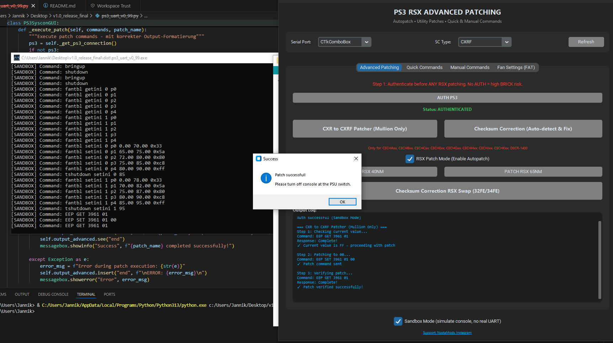
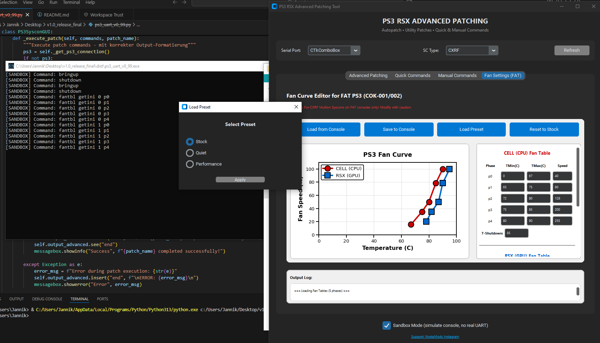
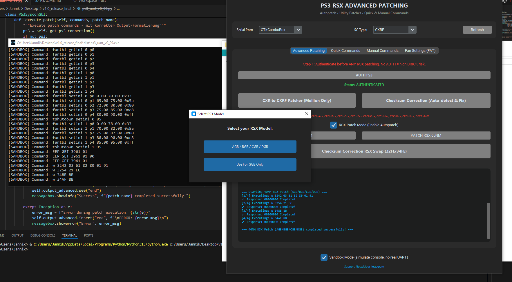
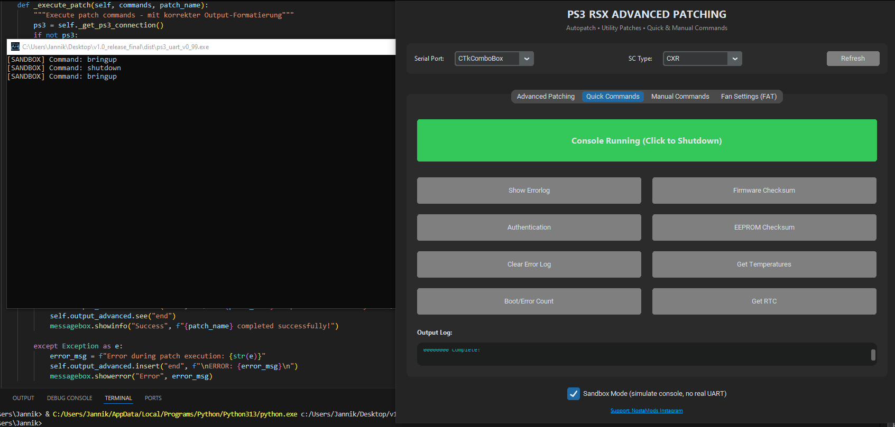

# PS3 RSX Advanced Patching Tool

> **A modern, user-friendly GUI for PS3 Syscon operations, RSX patching, and fan curve management**

[]()
[]()
[]()

**Note:** This documentation was originally written in German and translated to English using AI. Please report any unclear sections.

**WARNING:** THIS IS A PRE-RELEASE VERSION, USE WITH CARE! 

## Overview

Professional GUI tool for PS3 hardware modification, specifically designed for:
- **RSX chip swapping** (40nm/65nm patching)
- **Syscon EEPROM** reading/writing
- **Fan curve management** for FAT consoles (CXRF mode)
- **Quick access** to common Syscon commands

This tool provides a **modern interface** for operations traditionally requiring manual command entry, making PS3 hardware work more accessible and less error-prone.

## Important Notice

**THIS IS EARLY ACCESS SOFTWARE**
- Always verify outputs manually
- Requires UART-TTL adapter hardware
- For experienced users with PS3 hardware knowledge
- **Use at your own risk** - no warranty provided

**This tool does NOT:**
- Replace hardware requirements
- Make decisions for you
- Guarantee success on all systems

## Key Features

### Safety First
- **Authentication check** before enabling sensitive operations
- **Sandbox mode** for testing without real hardware
- **Comprehensive validation** for fan curves and temperature limits
- **Checksum verification** for EEPROM modifications

### Core Functions
- **40nm/65nm RSX Patching** with model-specific options (AGB/BGB/CGB/DGB vs GGB)
- **Automatic checksum correction** (32FE/34FE addresses)
- **Internal/External mode patching** (CXR/CXRF)
- **EEPROM read/write** operations
- **Error log management** with clearing functionality

### Advanced Features
- **Interactive fan curve editor** with live graph visualization
- **5-phase temperature management** (simplified interface)
- **Preset profiles** (Stock, Quiet, Performance)
- **Real-time temperature monitoring** via `tsensor`
- **Drag-and-drop** curve editing

### Quick Commands
- Boot/Error Count (`becount`)
- Temperature readings (`tsensor`)
- RTC information (`getrtc`)
- Error log display
- Firmware checksums
- Authentication status

### Built-in Documentation
- **Command reference** with 100+ internal commands
- **Inline help** for common operations
- **Tooltips and warnings** for critical actions

## Requirements

### Hardware
- PS3 console (FAT or Slim)
- **UART-TTL adapter** (mandatory)
- USB cable for serial connection

### Software
- Windows 10/11
- Python 3.x (for source version)
- Serial drivers for UART adapter

### Python Dependencies
```bash
pip install pyserial customtkinter pycryptodome matplotlib
```

## Installation

### Option 1: Executable (Recommended)
1. Download the latest `.exe` from [Releases]()
2. Run the Inno Setup installer
3. Launch the application

### Option 2: From Source
```bash
git clone https://github.com/YOUR_USERNAME/ps3-rsx-tool.git
cd ps3-rsx-tool
pip install -r requirements.txt
python ps3_uart_SIMPLIFIED_WORKING.py
```

## Quick Start

1. **Connect Hardware**
   - Connect UART adapter to PS3 Syscon
   - Connect USB cable to PC
   - Note the COM port (e.g., COM3)

2. **Launch Tool**
   - Select correct COM port
   - Choose SC Type (CXR, CXRF, or SW)
   - Enable Sandbox Mode for testing (optional)

3. **Authenticate**
   - Click "AUTH PS3" in Advanced Patching tab
   - Wait for successful authentication
   - Sensitive buttons will unlock

4. **Perform Operations**
   - Use Quick Commands for common tasks
   - Advanced Patching for RSX modifications
   - Fan Settings for thermal management (CXRF only)

## Screenshots

### Main Interface


### Fan Curve Editor


### RSX Patcher


### Quick Commands


## Usage Guide

### RSX Patching (40nm/65nm)
1. **Authenticate** first (mandatory)
2. Select **40nm** or **65nm** patch
3. For 40nm, choose model: AGB/BGB/CGB/DGB vs GGB
4. Verify output in log
5. Run **Checksum Correction** after patching

### Fan Curve Management (CXRF only)
1. Switch to **Fan Settings (FAT)** tab
2. Load current values or preset
3. Adjust temperatures and fan speeds
4. Validation prevents dangerous configurations
5. Save to console and fix checksum

### Safety Features
- **T-Shutdown warning** for values >85°C
- **Ascending temperature validation** (phases must increase)
- **TMax > TMin enforcement**
- **Phase order checking**

## SC Type Explanation

| Type | Description | Fan Control |
|------|-------------|-------------|
| **CXR** | COK-001 (older FAT, no fan control) | Disabled |
| **CXRF** | Mullion Syscon (FAT with fan tables) | Enabled |
| **SW** | Slim consoles | Disabled |

## Credits & Acknowledgments

This project builds upon extensive community work:

- **M4j0r** (PSX-Place Forum) - Reverse engineering contributions
- **db260179** - Original [ps3syscon](https://github.com/db260179/ps3syscon) foundation
- **PSX-Place Community** - Frankenstein mod documentation
- Special thread: [Frankenstein PHAT PS3 CECHA with 40nm RSX](https://www.psx-place.com/threads/frankenstein-phat-ps3-cecha-with-40nm-rsx.28069/)

All participants in PS3 Syscon reverse engineering and RSX swap experiments.

## Educational Context

This is my **first major programming project**, created to:
- Apply school programming lessons practically
- Streamline personal PS3 modding workflow
- Provide accessible tools for the community
- Practice GUI design and Python development

## Known Issues & Limitations

- Some features require manual verification
- Early Access status - bugs expected
- Not all edge cases tested
- Windows-only (currently)

## Future Plans

- Improved PS3 Slim support
- Additional safety validations
- Better error handling
- More preset options
- Internationalization

## Legal & Disclaimer

- **No warranties provided** - use at your own risk
- Requires technical knowledge of PS3 hardware
- **Private/educational use only** - no commercial use
- All trademarks belong to their respective owners
- No affiliation with Sony Interactive Entertainment
- AI-generated logo

**If you use this code or tool:**
**Please provide credits** and link back to this repository

## Philosophy

> "Use your brain before your click"

This tool **simplifies operations** but does not replace:
- Technical understanding
- Hardware knowledge
- Manual verification
- Critical thinking

## Support & Contributing

- **Issues**: Report bugs via GitHub Issues
- **Suggestions**: Feature requests welcome
- **Pull Requests**: Contributions appreciated
- **Feedback**: Help improve stability and usability

### Contribution Guidelines
- Test thoroughly before submitting
- Document changes clearly
- Follow existing code style
- Respect educational nature of project

## License

This project is provided for **educational and private use only**.

```
THE SOFTWARE IS PROVIDED "AS IS", WITHOUT WARRANTY OF ANY KIND.
IN NO EVENT SHALL THE AUTHORS BE LIABLE FOR ANY CLAIM, DAMAGES OR OTHER LIABILITY.
```

## Star History

If this tool helps you, consider giving it a star!

---

**Made with care for the PS3 modding community**

*Remember: This is a tool to assist experienced users, not a "magic button" for beginners.*

Professional GUI tool for PS3 hardware modification, specifically designed for:
- **RSX chip swapping** (40nm/65nm patching)
- **Syscon EEPROM** reading/writing
- **Fan curve management** for FAT consoles (CXRF mode)
- **Quick access** to common Syscon commands

This tool provides a **modern interface** for operations traditionally requiring manual command entry, making PS3 hardware work more accessible and less error-prone.

##  Important Notice

**THIS IS EARLY ACCESS SOFTWARE**
- Always verify outputs manually
- Requires UART-TTL adapter hardware
- For experienced users with PS3 hardware knowledge
- **Use at your own risk** - no warranty provided

**This tool does NOT:**
- Replace hardware requirements
- Make decisions for you
- Guarantee success on all systems

##  Key Features

###  Safety First
- **Authentication check** before enabling sensitive operations
- **Sandbox mode** for testing without real hardware
- **Comprehensive validation** for fan curves and temperature limits
- **Checksum verification** for EEPROM modifications

###  Core Functions
- **40nm/65nm RSX Patching** with model-specific options (AGB/BGB/CGB/DGB vs GGB)
- **Automatic checksum correction** (32FE/34FE addresses)
- **Internal/External mode patching** (CXR/CXRF)
- **EEPROM read/write** operations
- **Error log management** with clearing functionality

###  Advanced Features
- **Interactive fan curve editor** with live graph visualization
- **5-phase temperature management** (simplified interface)
- **Preset profiles** (Stock, Quiet, Performance)
- **Real-time temperature monitoring** via `tsensor`
- **Drag-and-drop** curve editing

###  Quick Commands
- Boot/Error Count (`becount`)
- Temperature readings (`tsensor`)
- RTC information (`getrtc`)
- Error log display
- Firmware checksums
- Authentication status

###  Built-in Documentation
- **Command reference** with 100+ internal commands
- **Inline help** for common operations
- **Tooltips and warnings** for critical actions

##  Requirements

### Hardware
- PS3 console (FAT or Slim)
- **UART-TTL adapter** (mandatory)
- USB cable for serial connection

### Software
- Windows 10/11
- Python 3.x (for source version)
- Serial drivers for UART adapter

### Python Dependencies
```bash
pip install pyserial customtkinter pycryptodome matplotlib
```

##  Installation

### Option 1: Executable (Recommended)
1. Download the latest `.exe` from [Releases]()
2. Run the Inno Setup installer
3. Launch the application

### Option 2: From Source
```bash
git clone https://github.com/YOUR_USERNAME/ps3-rsx-tool.git
cd ps3-rsx-tool
pip install -r requirements.txt
python ps3_uart_SIMPLIFIED_WORKING.py
```

##  Quick Start

1. **Connect Hardware**
   - Connect UART adapter to PS3 Syscon
   - Connect USB cable to PC
   - Note the COM port (e.g., COM3)

2. **Launch Tool**
   - Select correct COM port
   - Choose SC Type (CXR, CXRF, or SW)
   - Enable Sandbox Mode for testing (optional)

3. **Authenticate**
   - Click "AUTH PS3" in Advanced Patching tab
   - Wait for successful authentication
   - Sensitive buttons will unlock

4. **Perform Operations**
   - Use Quick Commands for common tasks
   - Advanced Patching for RSX modifications
   - Fan Settings for thermal management (CXRF only)

##  Screenshots

### Main Interface


### Fan Curve Editor


### Quick Commands


##  Usage Guide

### RSX Patching (40nm/65nm)
1. **Authenticate** first (mandatory)
2. Select **40nm** or **65nm** patch
3. For 40nm, choose model: AGB/BGB/CGB/DGB vs GGB
4. Verify output in log
5. Run **Checksum Correction** after patching

### Fan Curve Management (CXRF only)
1. Switch to **Fan Settings (FAT)** tab
2. Load current values or preset
3. Adjust temperatures and fan speeds
4. Validation prevents dangerous configurations
5. Save to console and fix checksum

### Safety Features
- **T-Shutdown warning** for values >85°C
- **Ascending temperature validation** (phases must increase)
- **TMax > TMin enforcement**
- **Phase order checking**

##  SC Type Explanation

| Type | Description | Fan Control |
|------|-------------|-------------|
| **CXR** | COK-001 (older FAT, no fan control) |  Disabled |
| **CXRF** | Mullion Syscon (FAT with fan tables) | � Enabled |
| **SW** | Slim consoles |  Disabled |

##  Credits & Acknowledgments

This project builds upon extensive community work:

- **M4j0r** (PSX-Place Forum) - Reverse engineering contributions
- **db260179** - Original [ps3syscon](https://github.com/db260179/ps3syscon) foundation
- **PSX-Place Community** - Frankenstein mod documentation
- Special thread: [Frankenstein PHAT PS3 CECHA with 40nm RSX](https://www.psx-place.com/threads/frankenstein-phat-ps3-cecha-with-40nm-rsx.28069/)

All participants in PS3 Syscon reverse engineering and RSX swap experiments.

##  Educational Context

This is my **first major programming project**, created to:
- Apply school programming lessons practically
- Streamline personal PS3 modding workflow
- Provide accessible tools for the community
- Practice GUI design and Python development

##  Known Issues & Limitations

- Some features require manual verification
- Early Access status - bugs expected
- Not all edge cases tested
- Windows-only (currently)

##  Future Plans

- Improved PS3 Slim support
- Additional safety validations
- Better error handling
- More preset options
- Internationalization

##  Legal & Disclaimer

- **No warranties provided** - use at your own risk
- Requires technical knowledge of PS3 hardware
- **Private/educational use only** - no commercial use
- All trademarks belong to their respective owners
- No affiliation with Sony Interactive Entertainment
- AI-generated logo

**If you use this code or tool:**
� **Please provide credits** and link back to this repository

##  Philosophy

> "Use your brain before your click"

This tool **simplifies operations** but does not replace:
- Technical understanding
- Hardware knowledge
- Manual verification
- Critical thinking

##  Support & Contributing

- **Issues**: Report bugs via GitHub Issues
- **Suggestions**: Feature requests welcome
- **Pull Requests**: Contributions appreciated
- **Feedback**: Help improve stability and usability

### Contribution Guidelines
- Test thoroughly before submitting
- Document changes clearly
- Follow existing code style
- Respect educational nature of project

##  License

This project is provided for **educational and private use only**.

```
THE SOFTWARE IS PROVIDED "AS IS", WITHOUT WARRANTY OF ANY KIND.
IN NO EVENT SHALL THE AUTHORS BE LIABLE FOR ANY CLAIM, DAMAGES OR OTHER LIABILITY.
```

##  Star History

If this tool helps you, consider giving it a !

---

**Made with  for the PS3 modding community**

*Remember: This is a tool to assist experienced users, not a "magic button" for beginners.*
