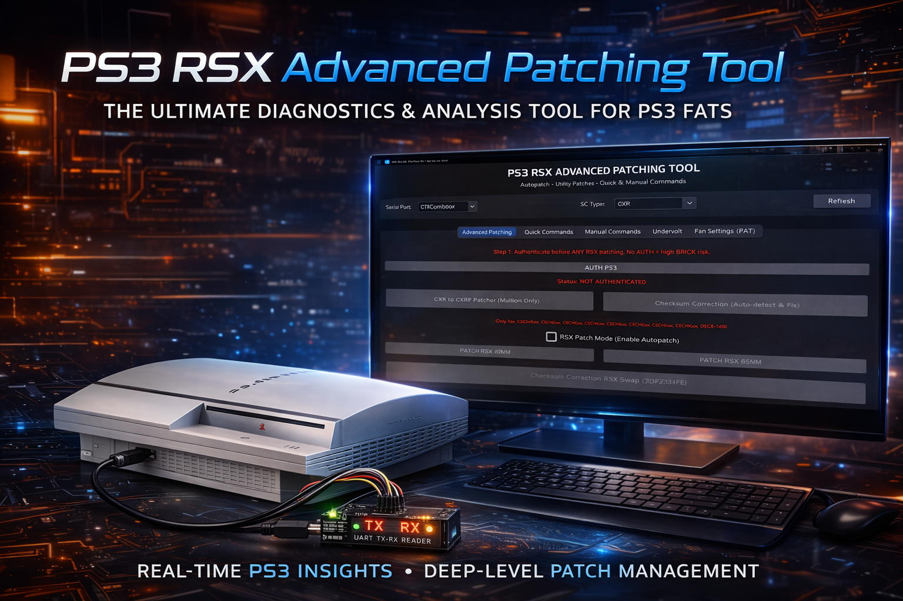

# NostaDiag PS3

> **A modern, user-friendly GUI for PS3 Syscon operations, RSX patching, fan curve management and built-in helper**

[]()
[]()
[]()



**Note:** This documentation was originally written in German and translated to English using AI. Please report any unclear sections.

⚠️ **This is v1.00 – bugs may exist! Use at your own risk.**

---

## Overview

Professional GUI tool for PS3 hardware modification, specifically designed for:
- **RSX chip swapping** (40nm/65nm patching)
- **Syscon EEPROM** reading/writing
- **Fan curve management** for FAT consoles (CXRF mode)
- **Quick access** to common Syscon commands
- **Built-in helper (Sysko)** with connection guides, error codes and setup walkthrough

---

## What's New in v1.00

See [changelog_v1.00.txt](changelog_v1.00.txt) for full details.

- **Sysko Helper** – built-in assistant (enable via checkbox)
- **Serial Connection Points** – UART testpad images for all PS3 models
- **Error Codes** – full PS3 Developer Wiki reference (PDF)
- **Setup Guide** – first-time setup walkthrough
- **White Mode** – activates together with Sysko
- **Chippy** – our mascot, animates on hover, opens help menu on click
- **Standalone .exe** – no Python installation required

---

## Important Notice

**THIS IS v1.00 SOFTWARE**
- Always verify outputs manually
- Requires UART-TTL adapter hardware
- For experienced users with PS3 hardware knowledge
- **Use at your own risk** – no warranty provided

---

## Key Features

### Safety First
- **Authentication check** before enabling sensitive operations
- **Sandbox mode** for testing without real hardware
- **Comprehensive validation** for fan curves and temperature limits
- **Checksum verification** for EEPROM modifications

### Core Functions
- **40nm/65nm RSX Patching** with model-specific options
- **Automatic checksum correction** (32FE/34FE addresses)
- **Internal/External mode patching** (CXR/CXRF)
- **EEPROM read/write** operations
- **Error log management**

### Advanced Features
- **Interactive fan curve editor** with live graph visualization
- **Preset profiles** (Stock, Quiet, Performance)
- **Real-time temperature monitoring**
- **Drag-and-drop** curve editing
- **Undervolting presets** for CELL and RSX

### Quick Commands
- Boot/Error Count (`becount`)
- Temperature readings (`tsensor`)
- RTC information (`getrtc`)
- Error log display
- Firmware checksums
- Authentication status

---

## Requirements

### Hardware
- PS3 console (FAT or Slim)
- **UART-TTL adapter** (mandatory)
- USB cable for serial connection

### Software
- Windows 10/11
- Python 3.x (for source version only)

### Python Dependencies
```bash
pip install pyserial customtkinter pycryptodomex pillow matplotlib
```

---

## Installation

### Option 1: Executable (Recommended)
1. Download `NostaDiag_PS3_v1.00.exe` from [Releases](../../releases)
2. Run the `.exe` – no installation needed

### Option 2: From Source
```bash
git clone https://github.com/jw0710/PS3_Syscon_Reader_QoL_Update.git
cd PS3_Syscon_Reader_QoL_Update
pip install -r requirments.txt
python main/NostaDiag_PS3_v1.00.py
```

---

## Quick Start

1. **Connect Hardware**
   - Connect UART adapter to PS3 Syscon
   - Connect USB cable to PC
   - Note the COM port (e.g., COM3)

2. **Launch Tool**
   - Select correct COM port
   - Choose SC Type (CXR, CXRF, or SW)
   - Enable Sandbox Mode for testing (optional)

3. **Authenticate**
   - Click "AUTH PS3" in Advanced Patching tab
   - Wait for successful authentication
   - Sensitive buttons will unlock

4. **Perform Operations**
   - Use Quick Commands for common tasks
   - Advanced Patching for RSX modifications
   - Fan Settings for thermal management (CXRF only)

---

## SC Type Explanation

| Type | Description | Fan Control |
|------|-------------|-------------|
| **CXR** | COK-001 (older FAT, no fan control) | Disabled |
| **CXRF** | Mullion Syscon (FAT with fan tables) | Enabled |
| **SW** | Slim/Super Slim consoles | Disabled |

---

## Credits & Acknowledgments

- **M4j0r** (PSX-Place Forum) – Reverse engineering contributions
- **PSX-Place Community** – Frankenstein mod documentation
- Special thread: [Frankenstein PHAT PS3 CECHA with 40nm RSX](https://www.psx-place.com/threads/frankenstein-phat-ps3-cecha-with-40nm-rsx.28069/)

---

## Educational Context

This is my **first major programming project**, created to:
- Apply school programming lessons practically
- Streamline personal PS3 modding workflow
- Provide accessible tools for the community

---

## Legal & Disclaimer

- **No warranties provided** – use at your own risk
- Requires technical knowledge of PS3 hardware
- **Private/educational use only** – no commercial use
- No affiliation with Sony Interactive Entertainment

> "Use your brain before your click"

---

## Support

- **Issues**: Report bugs via GitHub Issues
- **Instagram**: [NostaMods](https://www.instagram.com/nostamods/)

If any errors occur – please let me know!
